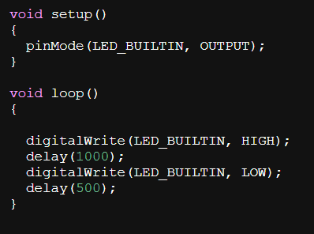
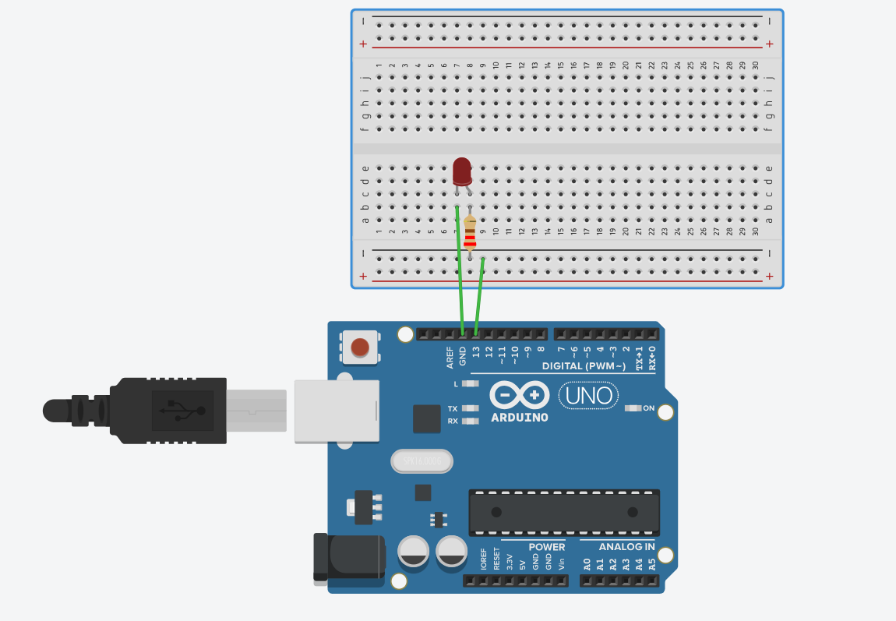

 

Figura 1 - Arduino 
 
 

 
 
Fonte: Pego na Internet (2025)

 

# Introducao ao Projeto

Este repositório registra a pratica com Arduino Uno em duas etapas: Parte 1 (LED interno) e Parte 2 (simulação no Tinkercad com LED externo). O objetivo é praticar temporização com delay(), uso de pinMode() e digitalWrite(), e a ligação segura de um LED off-board com resistor no pino 13. O material inclui código, montagem, prints, foto e vídeo=.

## Parte 1 
Objetivos - Fazer o LED interno do Arduino piscar com tempos diferentes de ligado (X) e desligado (Y).
Sendo: X = 3000ms,  Y = 500ms

 

Figura 1 - COdigo 
 
 

 
 
Fonte: Material feito pelo autor (2025)

 

 

Figura 2 - Codigo1 
 
 

 
 
Fonte: material feito pelo autor (2025)

 

## Como utilizar:
1 - Conectar o Arduino UNO ao computador via USB.
2 - Na IDE clique em  Ferramentas depois Placa, Arduino Uno e selecione a Porta correta.
3 - Utiliize o codigo acima e clicar em Upload.
4 - O LED interno começa a piscar na cadência configurada.

## Parte 2
Objetivos: Montar e simular no Tinkercad um LED externo em protoboard com resistor, controlado por um pino digital do Arduino.

Video de demosntração do projeto funcionando
<figure>
  <video controls playsinline muted width="640">
    <source src="assets/Video.mp4" type="video/mp4">
    Seu navegador não suporta vídeo embutido. 
    <a href="assets/Video.mp4">Baixe o arquivo aqui</a>.
  </video>
  <figcaption>Pisca-pisca do Arduino (interno/externo).</figcaption>
</figure>

Codigo da simulação do Tinkercad, tendo como X = 1000ms e Y = 500ms.
 

Figura 3 - Thinkercad codigo 
 
 

 
 
Fonte: material feito pelo autor (2025)

 

 

Figura 4 - Thinkercad 
 
 

 
 
Fonte: material feito pelo autor (2025)

 

# Links 

 Thinkercad -https://www.tinkercad.com/things/eXFijO8Gmyq-shiny-blorr/editel?returnTo=https%3A%2F%2Fwww.tinkercad.com%2Fdashboard